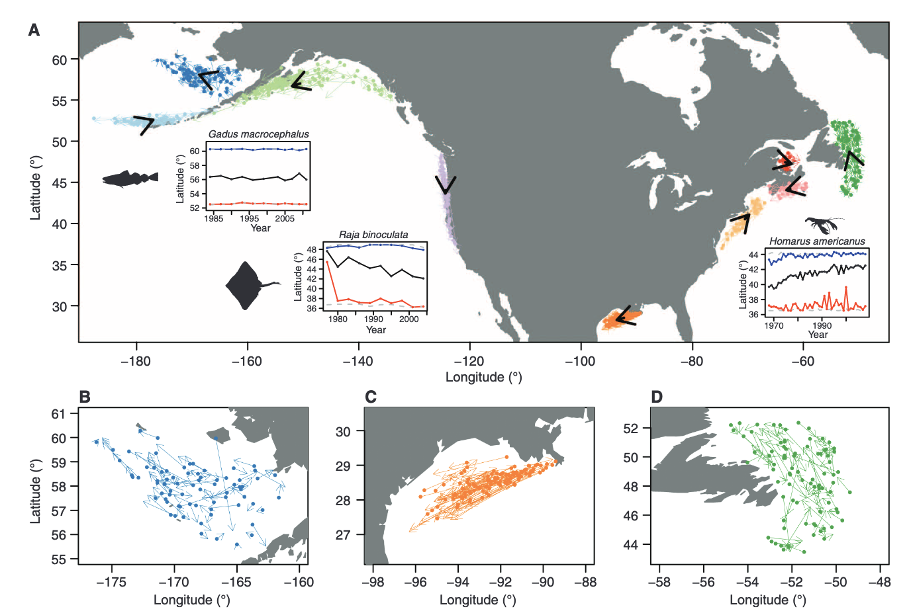
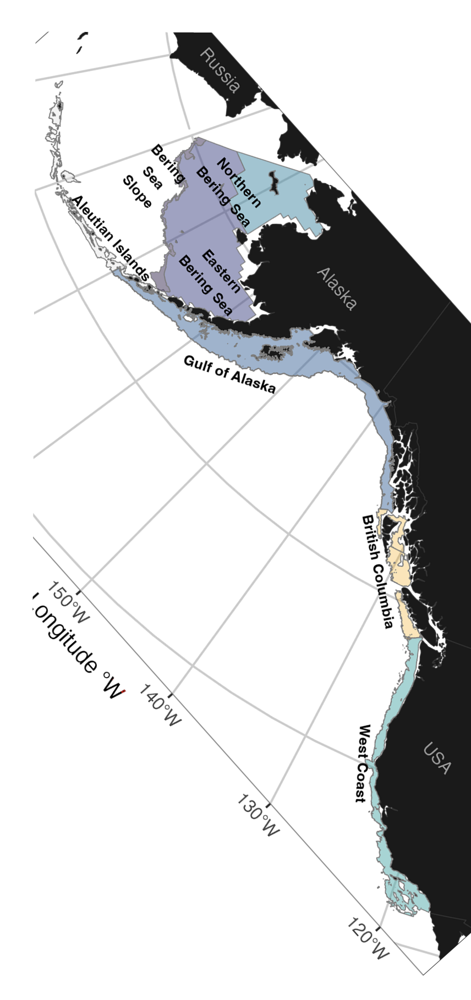
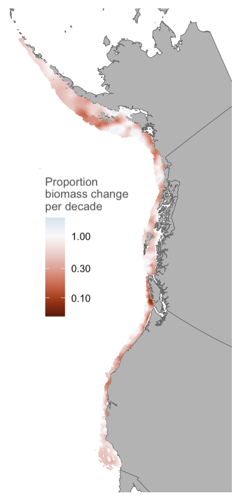
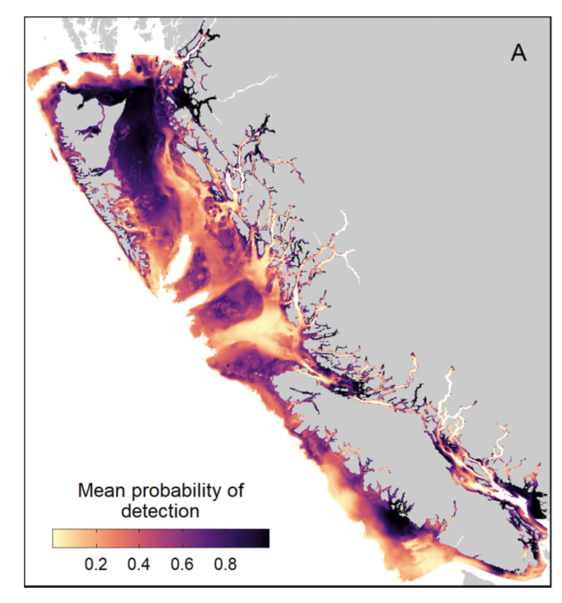
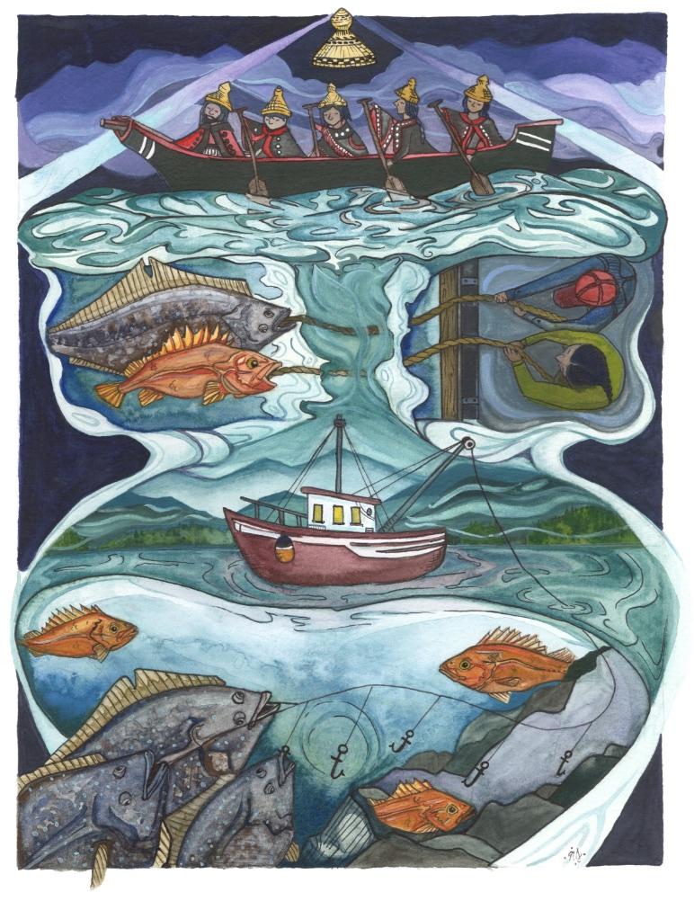
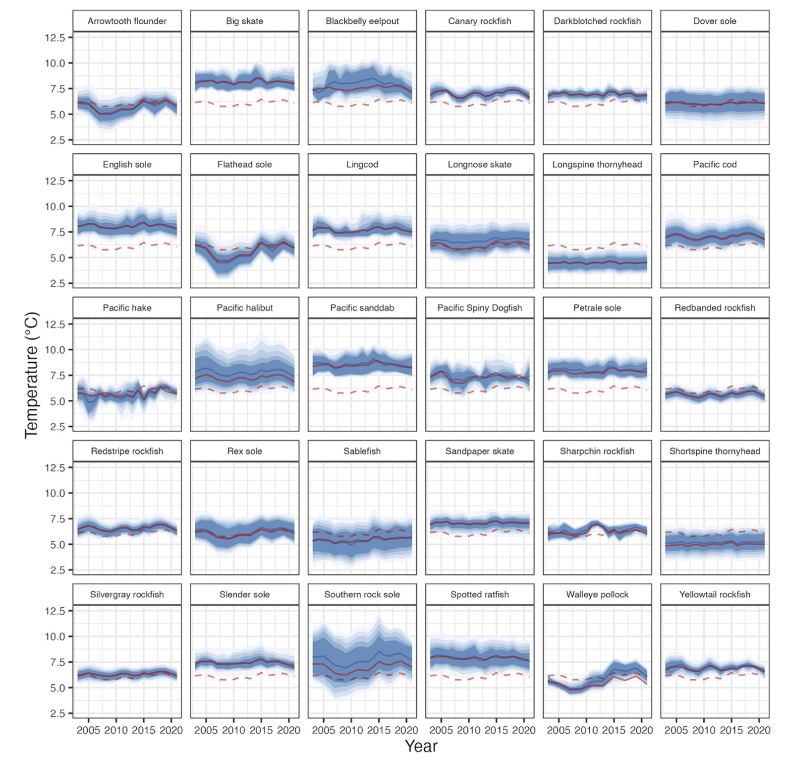
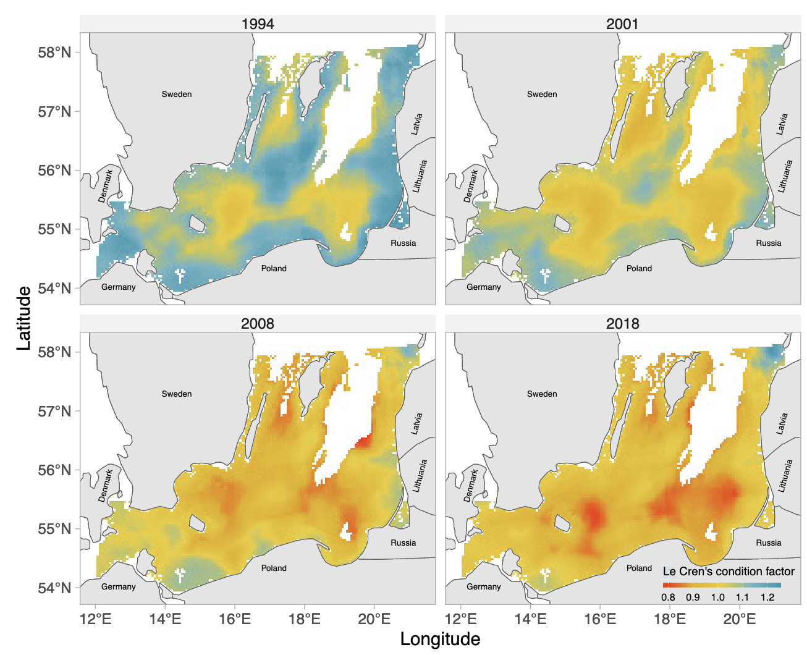
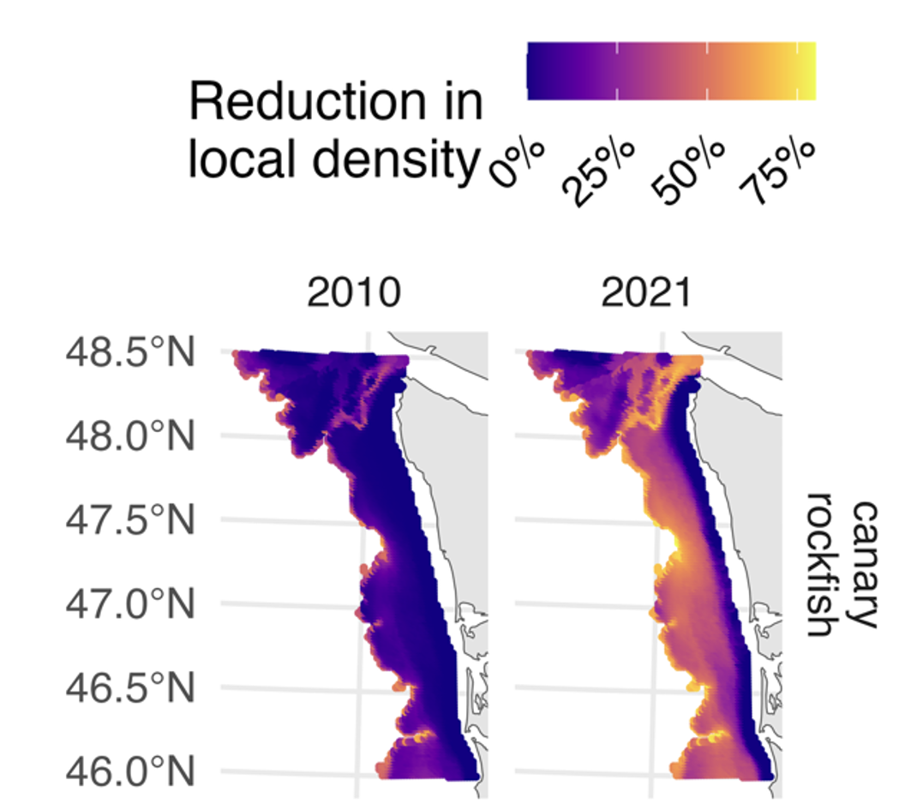
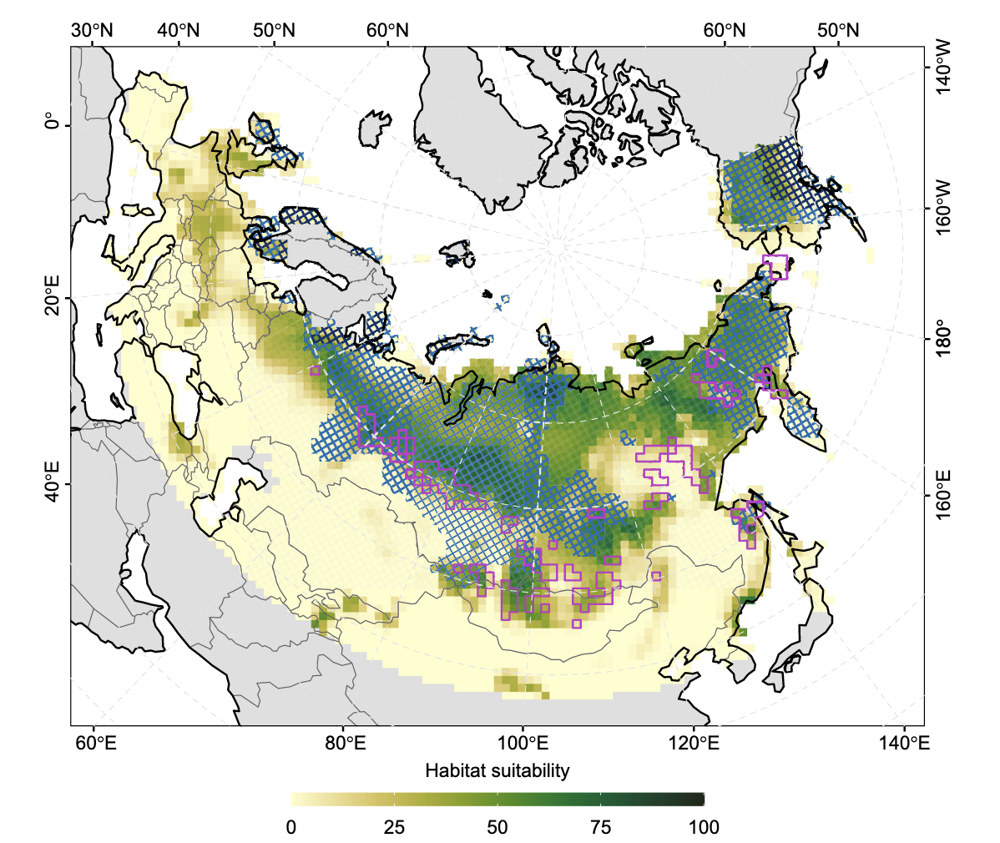
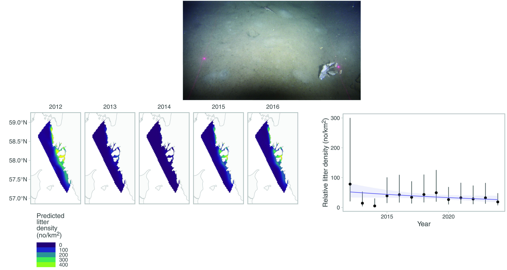

<!-- Build with: xaringan::inf_mr() -->

```{r preamble, include=FALSE, cache=FALSE}
source(here::here("slides/preamble.R"))
do.call(knitr::opts_chunk$set, knitr_opts)
```

```{r libs, include=FALSE}
library(dplyr)
library(sdmTMB)
library(ggplot2)
library(mgcv)
```

# Why study distribution shifts?

Species distributions are changing in response to climate, fishing pressure, and habitat changes

--

Management and conservation are aided by understanding how distributions are changing and may change in the future

--

Cross-border coordination requires understanding range-wide distributions

--

Shifting distributions can cross management boundaries, affecting quota allocations

---

### We have wonderful scientific surveys, but...

Surveys don't always cover the same areas every year

--

Sampling effort varies spatially and temporally

--

Even faithfully implemented random or random stratified designs introduce spatial sampling noise

--

We often want to combine multiple surveys

--

Different surveys may use different gear, vessels, or protocols

--

Raw survey catch data can't reliably tell us about true distribution changes vs. sampling artifacts

---

### Raw sampling data can confuse sampling changes with distribution changes



.xtiny[
Pinsky, M.L., Worm, B., Fogarty, M.J., Sarmiento, J.L., and Levin, S.A. 2013. Marine taxa track local climate velocities. Science 341(6151): 1239–1242. doi:10.1126/science.1239352.
]

---

### Species ranges often cover multiple surveys

.pull-left[

]

.pull-right[

]

.xtiny[
Davidson, L.N.K., English, P.A., King, J., Grant, P.B.C., Taylor, I.G., Barnett, L.A.K., Gertseva, V., Tribuzio, C.A., and Anderson, S.C. 2026. Mystery of the disappearing dogfish: transboundary analyses reveal steep population declines across the northeast pacific with little evidence for regional redistribution. Fish and Fisheries 27(1): 1–12. doi:10.1111/faf.70028.
]

---

# The solution: model-based metrics

.large[
1. Fit a statistical spatiotemporal ("dynamic") species distribution model

2. Predict to a constant spatial grid
(standardizes for spatial, gear, and effort variation in sampling)

3. Calculate distribution metrics from those predictions with uncertainty
]

.tiny[
Thorson, J.T., Pinsky, M.L., and Ward, E.J. 2016. Model-based inference for estimating shifts in species distribution, area occupied and centre of gravity. Methods Ecol Evol 7(8): 990–1002. doi:10.1111/2041-210X.12567.
]

---

# Metrics we'll focus on

.large[
Center of gravity

Density-weighted habitat variables

Range edges

Effective area occupied

Spatially varying trends

Subregional population indices
]

---

class: center, middle, inverse

# The first and most complicated part:<br><br>Fitting a useful model

---

# Fitting a useful model

To calculate reliable distribution metrics, we need to understand how to fit models to large spatiotemporal survey datasets

--

Spatial data has challenges to modelling

--

Temporal data has challenges to modelling

--

Spatiotemporal data has *a lot* to think to think about when modelling

--

That's going to be the focus of much of this workshop

---

class: middle, inverse

# To make reliable inference on species distribution changes, we first need a good model-based representation of species distribution

---

class: middle

# sdmTMB is an R package that (hopefully) helps you fit a reasonable spatiotemporal model to species distribution data.

# Among many uses, it also helps you summarize distribution metrics from the model output.

---

class: center, middle, inverse

# A few example uses related to distribution or distribution change

---

# Groundfish climate velocities

.center[

]

.tiny[
English, P.A., Ward, E.J., Rooper, C.N., Forrest, R.E., Rogers, L.A., Hunter, K.L., Edwards, A.M., Connors, B.M., and Anderson, S.C. 2021. Contrasting climate velocity impacts in warm and cool locations show that effects of marine warming are worse in already warmer temperate waters. Fish and Fisheries 23(1): 239–255. doi:10.1111/faf.12613.
]

---

##### Integrating dive, trawl, and trap surveys for Dungeness crab

.center[

]

.xtiny[
Thompson, P.L., Anderson, S.C., Nephin, J., Robb, C.K., Proudfoot, B., Park, A.E., Haggarty, D.R., and Rubidge, E.M. 2023. Integrating trawl and longline surveys across British Columbia improves groundfish distribution predictions. Can. J. Fish. Aquat. Sci. 80(1): 195–210. doi:10.1139/cjfas-2022-0108.
]

---

##### Quantifying expected bycatch ratios based from spatiotemporal distribution to inform legal expansion of Indigenous fishing rights

.pull-left[

]

.pull-right[
<br>
<br>
.tiny[
English, P.A., Picco, C.M., Edwards, J.C., Haggarty, D.R., Forrest, R.E., and Anderson, S.C. 2023. Spatial restrictions hinder avoidance of choke species in an Indigenous rights-based fishery. People and Nature 6: 75–90. <https://doi.org/10.1002/pan3.10554>
]
]

---

#### Thermal niche changes for Pacific groundfish

.center[

]

.xtiny[
Ward, E.J., et al. 2024. Win, lose, or draw: Evaluating dynamic thermal niches of northeast Pacific groundfish. PLOS Climate 3(11): e0000454. Public Library of Science. doi:10.1371/journal.pclm.0000454.
]

---

##### Biomass and condition distribution changes for Baltic Sea cod

.center[

]

.xtiny[
Lindmark, M., Anderson, S.C., Gogina, M., and Casini, M. 2023. Evaluating drivers of spatiotemporal variability in individual condition of a bottom-associated marine fish, Atlantic cod (*Gadus morhua*). ICES Journal of Marine Science 80(5): 1539–1550. <https://doi.org/10.1093/icesjms/fsad084>.
]

---

#### Oxygen limitation effects on fish distribution

.center[

]

.xtiny[
Indivero, J., Anderson, S.C., Barnett, L.A.K., Thorson, J.T., Siedlecki, S., Ward, E.J., Essington, T.E. Oxygen constrains local densities across diverse marine bottom-associated marine fishes. Preprint posted soon.

Indivero, J., Anderson, S.C., Barnett, L.A.K., Essington, T.E., and Ward, E.J. 2025. Estimating a physiological threshold to oxygen and temperature from marine monitoring data reveals challenges and opportunities for forecasting distribution shifts. Ecography 2025(e07413). doi:10.1111/ecog.07413.
]

---

#### More than just fish!<br>52,000 years of woolly rhinoceros population dynamics

.center[

]

.xtiny[
Fordham, D.A., Brown, S.C., Canteri, E., Austin, J.J., Lomolino, M.V., Haythorne, S., Armstrong, E., Bocherens, H., Manica, A., Rey-Iglesia, A., Rahbek, C., Nogués-Bravo, D., and Lorenzen, E.D. 2024. 52,000 years of woolly rhinoceros population dynamics reveal extinction mechanisms. Proc. Natl. Acad. Sci. U.S.A. 121(24): e2316419121. doi:10.1073/pnas.2316419121.
]

---

#### Spatiotemporal dynamics of Swedish marine garbage

.center[

]

.xtiny[
Norén, K., Svensson, F., and Lindmark, M. 2025. Evaluating the potential of underwater television to contribute to marine litter assessments alongside bottom trawling. PLoS One 20(6): e0324900. <https://10.1371/journal.pone.0324900>.
]

---

### Increasingly used by agencies for distribution modelling and index standardization

* DFO
* NOAA: NWFSC, AFSC, ...
* Pacific Hake U.S.-Canada assessment
* Norwegian and Swedish governments
* NAFO; STACREC .tiny[Standing Committee on Research Coordination]
* ICES
* Inter-American Tropical Tuna Commission
* International Scientific Committee (ISC) for tuna and billfish assessments

---

class: center, middle, inverse

# Workshop plan

---

# Plan for the 3-day workshop

Day 1: Intro to random fields, intro to sdmTMB, spatial models, spatiotemporal models, model comparison/validation, residuals

--

Day 2: Families, delta models, time-varying effects, spatially varying effects, index standardization

--

Day 3: Integrated models, forecasting, simulating, **metrics of distribution change**, future directions, closing thoughts

---

# Plan for the workshop

Each day: a mix of lectures and exercises, breaks as needed, talks on applied sdmTMB uses

Have questions? Please ask any time or in the [Google Doc](https://docs.google.com/document/d/19zveT73HVWa73UhxsAcDntAhrBDX_F327otqve7RQ4Y/edit?tab=t.0). Thanks!

---

class: center, middle, inverse

# Modelling spatial/spatiotemporal data

---

# Geostatistical data

We're focused on **geostatistical** data: observations of a continuous spatial process at georeferenced locations

--

I.e., we pick spatial coordinates to sample at and observe something, like the number or weight of fish (as opposed to "point process" data or "areal" data)

```{r field-samples, fig.asp=0.4}
set.seed(123)
predictor_dat <- data.frame(
  X = runif(300), Y = runif(300),
  year = 1
)
mesh <- make_mesh(predictor_dat,
  xy_cols = c("X", "Y"),
  cutoff = 0.1
)
sim_dat <- sdmTMB_simulate(
  formula = ~1,
  data = predictor_dat,
  time = "year",
  mesh = mesh,
  family = lognormal(),
  range = 0.3,
  sigma_E = 0,
  phi = 0.05,
  sigma_O = 0.6,
  seed = 7,
  B = c(0) # B0 = intercept
)
ggplot(sim_dat, aes(X, Y, col = observed * 10)) +
  geom_point(alpha = 0.9, size = 3) +
  scale_colour_viridis_c() +
  labs(colour = "Observed\ncatch weight")
```

---

# Modelling spatial data

Data often have spatial attributes

Ideal world:
  1. Plug spatial covariates into a regression model
  2. Residuals are uncorrelated

```{r sim-rf-intro, echo=FALSE, fig.asp=0.4}
set.seed(123)
predictor_dat <- data.frame(
  X = runif(300), Y = runif(300),
  year = 1
)
mesh <- make_mesh(predictor_dat,
  xy_cols = c("X", "Y"),
  cutoff = 0.1
)
sim_dat <- sdmTMB_simulate(
  formula = ~1,
  data = predictor_dat,
  time = "year",
  mesh = mesh,
  family = gaussian(link = "identity"),
  range = 0.00001,
  sigma_E = 0.1,
  phi = 0.01,
  sigma_O = 0.2,
  seed = 3542,
  B = c(0) # B0 = intercept
)

ggplot(sim_dat, aes(X, Y, col = observed)) +
  geom_point(alpha = 0.7, size = 3) +
  guides(col = guide_legend(title = "Residuals")) +
  scale_color_gradient2()
```

---

# Reality

Residual spatial autocorrelation is pervasive.

--

Alternatively, there are unmodelled, missing, or "latent" spatially structured covariates

```{r sim-rf-intro-cor, echo=FALSE, fig.asp=0.4}
set.seed(123)
predictor_dat <- data.frame(
  X = runif(300), Y = runif(300),
  year = 1
)
mesh <- make_mesh(predictor_dat,
  xy_cols = c("X", "Y"),
  cutoff = 0.1
)
sim_dat <- sdmTMB_simulate(
  formula = ~1,
  data = predictor_dat,
  time = "year",
  mesh = mesh,
  family = gaussian(link = "identity"),
  range = 0.25,
  sigma_E = 0.1,
  phi = 0.01,
  sigma_O = 0.1,
  seed = 3542,
  B = c(0) # B0 = intercept
)

ggplot(sim_dat, aes(X, Y, col = observed)) +
  geom_point(alpha=0.7, size=3) +
  guides(col=guide_legend(title="Residuals")) +
  scale_color_gradient2()
```

---

# Why worry about these latent spatial variables?

1. Often they are of ecological interest

--

2. Ignoring them hurts our predictions

--

3. Ignoring them messes up our quantification of uncertainty

---

# Modeling latent spatial variables

Need a 'wiggly' surface for approximating all missing spatially structured variables

--

Several approaches exist. For example:
  * 2D smoothers with GAMs (e.g., mgcv)
  * Gaussian random fields
  * Random forests etc.

.tiny[
Miller, D.L., Glennie, R., and Seaton, A.E. 2019. Understanding the Stochastic Partial Differential Equation approach to smoothing. JABES.

Stock, B.C., Ward, E.J., Eguchi, T., Jannot, J.E., Thorson, J.T., Feist, B.E., and Semmens, B.X. 2019. Comparing predictions of fisheries bycatch using multiple spatiotemporal species distribution model frameworks. CJFAS.
]

---

# Why focus on Gaussian random fields?

Random fields are nice because

--

1. They are very flexible in the shapes they can fit

--

2. They can be fit efficiently

--

3. They estimate ecologically interpretable parameters

---

# What is a random field?

```{r sim-rf-dat, message=FALSE, warning=FALSE}
predictor_dat <- expand.grid(
  x = seq(0, 1, length.out = 100),
  y = seq(0, 1, length.out = 100),
  year = seq_len(6)
)
mesh <- make_mesh(predictor_dat, xy_cols = c("x", "y"), cutoff = 0.05)
sim_dat <- sdmTMB_simulate(
  formula = ~1,
  data = predictor_dat,
  time = "year",
  mesh = mesh,
  family = gaussian(),
  range = 0.5,
  sigma_E = 0.2,
  phi = 0.1,
  sigma_O = NULL,
  seed = 1,
  B = 0
)
```

```{r random-field-demo}
ggplot(sim_dat, aes(x, y, fill = mu)) +
  facet_wrap(vars(year)) +
  geom_raster() +
  scale_fill_gradient2() +
  coord_fixed(expand = FALSE)
```

---
background-image: url("images/eagle.png")
background-position: bottom right
background-size: 35%

# Random field


---
background-image: url("images/beaker.png")
background-position: bottom right
background-size: 35%

# Random field

A 2 dimensional "Gaussian Process".

A realization from a multivariate normal distribution constrained by some covariance function.

---
background-image: url("images/elmo.png")
background-position: bottom right
background-size: 30%

# Random fields

A way of estimating a wiggly surface to account for spatial and/or spatiotemporal correlation in data.

--

Alternatively, a way of estimating a wiggly surface to account for unobserved spatially structured variables.

--

As a bonus, they provide useful parameter estimates: spatial variance (magnitude of wiggles) and the rate at which data become uncorrelated with distance (how smooth are the wiggles).

---

# Correlation/covariance functions

- These constrain the random field MVN distribution.

--

- They define how correlation decays with distance.

--

- Can be isotropic or anisotropic.

--

- Common choices: exponential, Gaussian, Matérn.

---

# Exponential correlation

$$
\mathcal{C}\left(d\right) = e^{ -d/\rho }
$$

- $d$ is distance
- $\rho$ controls the rate of correlation decay with distance

```{r exp-cov, fig.asp=0.45}
exp_cor<- function(d, rho = 0.2) exp(-d/rho)
d <- data.frame(x = seq(0, 1, length.out = 300))
d1 <- data.frame(x = d$x, y = exp_cor(d$x, rho = 0.2), rho = 0.2)
d2 <- data.frame(x = d$x, y = exp_cor(d$x, rho = 0.1), rho = 0.1)
d3 <- data.frame(x = d$x, y = exp_cor(d$x, rho = 0.4), rho = 0.4)

dplyr::bind_rows(list(d1, d2, d3)) |>
  ggplot(aes(x, y, colour = rho, group = rho)) + geom_line() +
  labs(y = "Correlation", x = "Distance") +
  coord_cartesian(expand = FALSE)
```

---

# Gaussian or squared exponential correlation

$$
\mathcal{C}\left(d\right) = e^{ -\left(d/\rho\right)^{2} }
$$
- $d$ is distance
- $\rho$ controls the rate of correlation decay with distance

```{r gauss-cov, fig.asp=0.45}
gaus_cor<- function(d, rho = 0.2) exp(-(d/rho)^2)
d <- data.frame(x = seq(0, 1, length.out = 300))
d1 <- data.frame(x = d$x, y = gaus_cor(d$x, rho = 0.2), rho = 0.2)
d2 <- data.frame(x = d$x, y = gaus_cor(d$x, rho = 0.1), rho = 0.1)
d3 <- data.frame(x = d$x, y = gaus_cor(d$x, rho = 0.4), rho = 0.4)
dplyr::bind_rows(list(d1, d2, d3)) |>
  ggplot(aes(x, y, colour = rho, group = rho)) + geom_line() +
  labs(y = "Correlation", x = "Distance") +
  coord_cartesian(expand = FALSE)
```

---

# Matérn covariance

Flexible, can be exponential or Gaussian shape or other shapes

```{r matern-plot, fig.asp=0.51}
x <- seq(from = 0, to = 1.5, length.out = 300)
df <- data.frame(
  x = rep(x, 4),
  nu = sort(rep(c(0.5, 1, 2, 10), 100))
)
df$row <- seq(1, nrow(df))
df <- dplyr::group_by(df, row) |>
  dplyr::mutate(
    cov =
      rSPDE::matern.covariance(h = x, kappa = 5, nu = nu, sigma = 1)
  )
df$nu <- as.factor(df$nu)
ggplot(df, aes(x, cov, col = nu, group = nu)) +
  geom_line() +
  xlab("Distance") +
  ylab("Correlation") +
  scale_color_viridis_d() +
  guides(col = guide_legend(title = expression(nu))) +
  coord_cartesian(expand = FALSE)
```

---

# Matérn covariance

.xsmall[
$$
\mathcal{C} \left(d \right) = \frac{\sigma^2}{2^{\nu - 1}\Gamma(\nu)}
    (\kappa d)^\nu K_\nu \kappa d \quad 😱
$$
]

.xsmall[
- $d$ = distance
- $\Gamma$ = the gamma function
- $K_\nu$ = modified Bessel function of the 2nd kind(!)
- $\kappa$ = decorrelation rate
- $\sigma^2$ = variance
- $\nu$ is fixed at 1 to take advantage of SPDE
]

---

# Matérn covariance range

Range = distance where correlation has decayed<br>to $\sim$ 0.13.

$\mathrm{range} = \sqrt{8 \nu} / \kappa$, so if $\nu = 1$, $\mathrm{range} = \sqrt{8} / \kappa$

```{r matern-range, warning=FALSE, message=FALSE, fig.asp=0.35}
predictor_dat <- expand.grid(
  x = seq(0, 1, length.out = 100),
  y = seq(0, 1, length.out = 100),
  year = seq_len(1)
)
sim_mesh <- make_mesh(predictor_dat, xy_cols = c("x", "y"), cutoff = 0.01)
s1 <- sdmTMB_simulate(
  formula = ~1,
  data = predictor_dat,
  mesh = sim_mesh,
  range = 0.2,
  phi = 0.1,
  sigma_O = 0.2,
  seed = 1,
  B = 0
)
sim_g1 <- ggplot(s1, aes(x, y, fill = mu)) +
  geom_raster(show.legend = FALSE) +
  scale_fill_viridis_c(option = "C") +
  coord_cartesian(expand = FALSE) +
  theme_light() +
  ggtitle("(a) Range = 0.2") +
  labs(x = "X", y = "Y")

s2 <- sdmTMB_simulate(
  formula = ~1,
  data = predictor_dat,
  mesh = sim_mesh,
  range = 0.6,
  phi = 0.1,
  sigma_O = 0.2,
  seed = 1,
  B = 0
)
sim_g2 <- ggplot(s2, aes(x, y, fill = mu)) +
  geom_raster(show.legend = FALSE) +
  scale_fill_viridis_c(option = "C") +
  coord_cartesian(expand = FALSE) +
  theme_light() +
  ggtitle("(b) Range = 0.6") +
  labs(x = "X", y = "Y")

x <- seq(0, 1, length.out = 200)
r <- c(0.2, 0.6)
df <- data.frame(
  x = rep(x, length(r)),
  range = rep(r, each = length(x))
)
matern <- function(h, sigma = 1, kappa, nu = 1) {
  ret <- (sigma^2/(2^(nu - 1) * gamma(nu))) *
    ((kappa * abs(h))^nu) *
    besselK(kappa * abs(h), nu)
  ret
  ret[x == 0] <- sigma^2
  ret
}
blues <- RColorBrewer::brewer.pal(length(r) + 1, "Blues")[-1]
df$cor <- matern(df$x, kappa = sqrt(8) / df$range)
sim_g3 <- ggplot(df, aes(x, cor, col = as.factor(range), group = as.factor(range))) +
  geom_line() +
  theme_light() +
  xlab("Distance") +
  ylab("Correlation") +
  labs(colour = "Range") +
  coord_cartesian(expand = FALSE, ylim = c(0, 1)) +
  scale_colour_manual(values = blues) +
  geom_hline(yintercept = 0.13, col = "grey50", lty = 2) +
  scale_x_continuous(breaks = r) +
  theme(legend.position = c(0.7, 0.7)) +
  ggtitle("(c) Matérn correlation function")

cowplot::plot_grid(sim_g1, sim_g2, sim_g3, align = "h", ncol = 3L)
```

.tiny[
Lindgren, F., Rue, H., and Lindström, J. 2011. An explicit link between Gaussian fields and Gaussian Markov random fields: the stochastic partial differential equation approach. Journal of the Royal Statistical Society: Series B (Statistical Methodology) 73(4): 423–498.
]

---

# Effects of changing variance and range

```{r sim-rf-grid, echo=FALSE, fig.asp=0.7}
set.seed(123)
predictor_dat <- data.frame(
  X = runif(300), Y = runif(300),
  year = 1
)
mesh <- make_mesh(predictor_dat,
  xy_cols = c("X", "Y"),
  cutoff = 0.1
)

grid_pars = expand.grid("range"=c(0.1, 0.5),
                        "sigma_O" = c(0.05, 0.1))

for(i in 1:nrow(grid_pars)) {
  s <- sdmTMB_simulate(
    formula = ~1,
    data = predictor_dat,
    time = "year",
    mesh = mesh,
    family = gaussian(link = "identity"),
    range = grid_pars$range[i],
    sigma_E = NULL,
    phi = 0.01,
    sigma_O = grid_pars$sigma_O[i],
    seed = 3542,
    B = c(0) # B0 = intercept
  )
  s$range = grid_pars$range[i]
  s$sigma_O = grid_pars$sigma_O[i]
  if(i == 1) {
    sim_dat = s
  } else sim_dat = rbind(s, sim_dat)
}

sim_dat$sigma_O = paste0("sigma_O = ", sim_dat$sigma_O)
sim_dat$range = paste0("range = ", sim_dat$range)
ggplot(sim_dat, aes(X, Y, col = observed)) +
  geom_point(size=1) +
  scale_color_gradient2() +
  facet_wrap(range ~ sigma_O)
```

---

# Effects of adding noise

* Large observation error looks like noise

* $\sigma_{obs}$ >> $\sigma_{O}$

```{r sim-rf-large_phi, echo=FALSE, fig.asp=0.5}
set.seed(123)
predictor_dat <- data.frame(
  X = runif(300), Y = runif(300),
  year = 1
)
mesh <- make_mesh(predictor_dat,
  xy_cols = c("X", "Y"),
  cutoff = 0.1
)

sim_dat <- sdmTMB_simulate(
  formula = ~1,
  data = predictor_dat,
  time = "year",
  mesh = mesh,
  family = gaussian(link = "identity"),
  range = 0.5,
  sigma_E = 0.1,
  phi = 1.0,
  sigma_O = 0.1,
  seed = 3542,
  B = c(0.2) # B0 = intercept
)

ggplot(sim_dat, aes(X, Y, col = observed)) +
  geom_point(alpha=0.7, size=3) +
  scale_color_gradient2()
```

---

# Small observation errors

* $\sigma_{obs}$ << $\sigma_{O}$

```{r sim-rf-small_phi, echo = FALSE, fig.asp=0.5}
sim_dat <- sdmTMB_simulate(
  formula = ~ 1 ,
  data = predictor_dat,
  time = "year",
  mesh = mesh,
  family = gaussian(),
  range = 0.5,
  sigma_E = 0.1,
  phi = 0.01,
  sigma_O = 0.1,
  seed = 3542,
  B = 0.2
)

ggplot(sim_dat, aes(X, Y, col = observed)) +
  geom_point(alpha=0.7, size=3) +
  scale_color_gradient2()
```

---

class: center, middle, inverse

# SPDE approach: what you need to know<br>(*and a bit extra in case you find this stuff thrilling* 🤓)

---

# Estimating Gaussian random fields

.small[
Georeferenced data often involve 1000s or more points

We need to approximate the spatial field

Options include nearest neighbor methods, covariance tapering, predictive process models, binning, etc.

sdmTMB uses the SPDE approach from INLA
  * for VAST users, this is the same
  * INLA books:
    <https://www.r-inla.org/learnmore/books>
]

---

# INLA, fmesher, and the SPDE approach

.xsmall[
* SPDE: stochastic partial differential equation
]

--

.xsmall[
* A solution to a specific SPDE allows computing a precision matrix of a Gaussian *Markov* random field (GMRF) that is a good approximation to a Gaussian random field with **Matérn** covariance.
]

--

.xsmall[
* We can estimate this sparse precision matrix efficiently.
]

--

.xsmall[
* In short: the SPDE approach lets us efficiently estimate approximate Gaussian random fields by letting us work with GMRFs and their precision matrix.
]

--

.xsmall[
* INLA/fmesher performs data wrangling for SPDE estimation
  * INLA also performs approximate Bayesian estimation
  * sdmTMB uses fmesher to wrangle matrices, but uses TMB for maximum marginal likelihood estimation
]

.tiny[
Lindgren, F., Rue, H., and Lindström, J. 2011. An explicit link between Gaussian fields and Gaussian Markov random fields: the stochastic partial differential equation approach. Journal of the Royal Statistical Society: Series B (Statistical Methodology) 73(4): 423–498.

Miller, D.L., Glennie, R., and Seaton, A.E. 2019. Understanding the Stochastic Partial Differential Equation approach to smoothing. JABES. doi:10.1007/s13253-019-00377-z.
]

---

# Introducing meshes

The SPDE approach involves a triangulation over the area of interest; we call this a "mesh" or more accurately a "finite element mesh"

```{r mesh-example, fig.width=5}
mesh <- make_mesh(pcod, xy_cols = c("X", "Y"), cutoff = 10)
ggplot() +
  inlabru::gg(mesh$mesh) +
  geom_point(data = pcod, aes(x = X, y = Y), alpha = 0.1, pch = 20) +
  coord_equal()
```

---

# SPDE matrices (*extra*)

With the mesh, we can calculate 3 sparse matrices needed to calculate the precision matrix $\boldsymbol{Q}$

$$
\boldsymbol{Q} = \tau^2 \left(\kappa^4\boldsymbol{C_0} + 2\kappa^2\boldsymbol{G}_1 + \boldsymbol{G}_2 \right),
$$

- $\boldsymbol{C_0}$, $\boldsymbol{G_1}$, and $\boldsymbol{G_2}$ are these sparse matrices
- $\tau$ scales the precision matrix
- $\kappa$ is the decorrelation rate

---

# Getting back from $\tau$ to variance (*extra*)

.xsmall[
With this precision matrix representation of the Matérn, we need a way of converting from $\tau$ back to variance $\sigma^2$:
]

.small[
$\sigma^2 = \frac{1}{\left (4 \pi \tau^2 \kappa^2 \right)}$
]

.xsmall[
$\tau$ and $\kappa$ are parameters from the Matérn precision we will estimate.

Note that $\tau$ is inverse to $\sigma$.
]

```{r marg-variance, fig.asp=0.4}
predictor_dat <- expand.grid(
  x = seq(0, 1, length.out = 100),
  y = seq(0, 1, length.out = 100),
  year = seq_len(1)
)
sim_mesh <- make_mesh(predictor_dat, xy_cols = c("x", "y"), cutoff = 0.01)
.s1 <- sdmTMB_simulate(
  formula = ~1,
  data = predictor_dat,
  mesh = sim_mesh,
  range = 0.6,
  phi = 0.1,
  sigma_O = sqrt(1),
  seed = 1,
  B = 0
)
.s2 <- sdmTMB_simulate(
  formula = ~1,
  data = predictor_dat,
  mesh = sim_mesh,
  range = 0.6,
  phi = 0.1,
  sigma_O = sqrt(0.3),
  seed = 1,
  B = 0
)
lims <- range(c(.s2$mu, .s1$mu))

sim_g3 <- ggplot(.s1, aes(x, y, fill = mu)) +
  geom_raster(show.legend = FALSE) +
  scale_fill_viridis_c(option = "C", limits = lims) +
  coord_cartesian(expand = FALSE) +
  theme_light() +
  ggtitle("(a) Variance = 1") +
  labs(x = "X", y = "Y")

sim_g4 <- ggplot(.s2, aes(x, y, fill = mu)) +
  geom_raster(show.legend = FALSE) +
  scale_fill_viridis_c(option = "C", limits = lims) +
  coord_cartesian(expand = FALSE) +
  theme_light() +
  ggtitle("(b) Variance = 0.3") +
  labs(x = "X", y = "Y")
cowplot::plot_grid(sim_g3, sim_g4, align = "v")
```

---

# Interpolation from mesh to data (*extra*)

.small[
We usually interpolate from the mesh vertices (the random effects) to any observation or prediction locations using an interpolation (or "projection") matrix.
]

This is often called the "A matrix".

.xsmall[
```{r A-matrix, echo=TRUE}
loc <- as.matrix(sdmTMB::pcod[,c("X", "Y")])
mesh <- fmesher::fm_mesh_2d(loc = loc, cutoff = 5)
A <- fmesher::fm_basis(mesh, loc = loc)
nrow(loc) # number of data locations
mesh$n # number of mesh vertices
dim(A) # interpolation matrix dimensions
```
]

---

# Putting it all together (*extra*)

.xsmall[
**Before fitting:**

1. Create a mesh
2. Calculate SPDE matrices
3. Calculate interpolation matrices
]

--

.xsmall[
**Within the model:**

1. Use your SPDE matrices to construct the precision matrix
2. Evaluate the likelihood of the GMRF
3. Project from random effect vertices to the data locations
4. Add in anything else you want (e.g., other parameter effects)
4. Evaluate the data likelihood
5. Project from random effects vertices to any new prediction locations
6. Calculate derived quantities such as range and marginal variance
]

---
class: center, middle, inverse

background-image: url("images/flickr-9fTfup.jpg")
background-position: center
background-size: 100%

<div class="footer">CC BY-ND 2.0: https://flic.kr/p/9fTfup</div> 

---

# The good news

<br>
<br>
.xlarge[sdmTMB does those steps for you 🤓]


