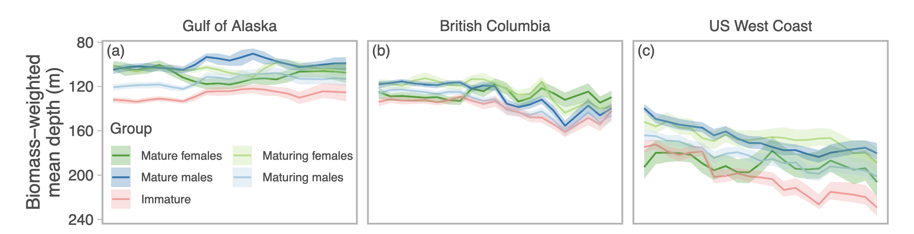
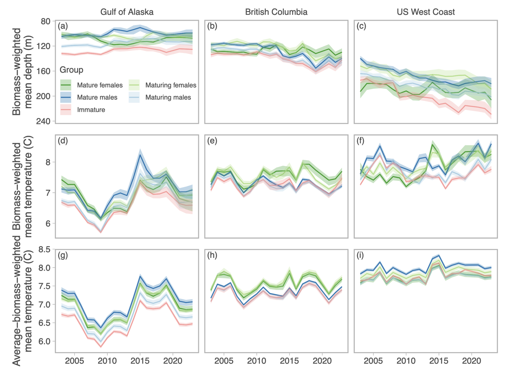

<!-- Build with: xaringan::inf_mr() -->

```{r preamble, include=FALSE, cache=FALSE}
source(here::here("slides/preamble.R"))
do.call(knitr::opts_chunk$set, knitr_opts)
```

```{r libs, include=FALSE}
library(dplyr)
library(sdmTMB)
library(ggplot2)
```

# Metrics we'll cover

.large[
Center of gravity

Density weighted habitat variables

Range edges

Effective area occupied

Spatially varying trends
]

---

# General idea throughout

.large[
1. Fit a reasonable spatiotemporal model (😮‍💨)

2. Predict to a constant grid over the spatial domain
(standardizes for spatial variation in sampling, combining data sources, etc.)

3. Calculate metrics from those predictions with uncertainty
]

---

# Center of gravity

.small[
Density-weighted mean latitude and longitude

Tells us how the center of the distribution is changing over time

Can obscure smaller-scale variation

Several spatial patterns can create the same center of gravity
]

.tiny[
See for review of 1980s/90s citations: Woillez, M., Poulard, J.-C., Rivoirard, J., Petitgas, P., and Bez, N. 2007. Indices for capturing spatial patterns and their evolution in time, with application to European hake (Merluccius merluccius) in the Bay of Biscay. ICES J Mar Sci 64(3): 537–550. <https://doi.org/10.1093/icesjms/fsm025>.

The GMRF model-based version we're doing here: Thorson, J.T., Pinsky, M.L., and Ward, E.J. 2016. Model-based inference for estimating shifts in species distribution, area occupied and centre of gravity. Methods Ecol Evol 7(8): 990–1002. <https://doi.org/10.1111/2041-210X.12567>.
]

---

# Density weighted habitat variables

Exactly what the center of gravity is, but applied to other habitat variables

E.g., density-weighted mean depth

E.g., density-weighted mean temperature

For dynamic habitat variables (e.g., temperature) consider comparing to pattern with static distribution.

---

### Density-weighted habitat variables example



.tiny[
Davidson, L.N.K., English, P.A., King, J., Grant, P.B.C., Taylor, I.G., Barnett, L.A.K., Gertseva, V., Tribuzio, C.A., and Anderson, S.C. 2026. Mystery of the disappearing dogfish: transboundary analyses reveal steep population declines across the northeast pacific with little evidence for regional redistribution. Fish and Fisheries 27(1): 1–12. <https://doi.org/10.1111/faf.70028>.
]

---

### Density-weighted habitat variables example



---

# Range edges

.small[
Accumulate grid cells in one direction (e.g., south to north) and calculate the point at which you accumulate quantiles of biomass or abundance density

Median is a robust version similar in spirit to center of gravity

Tail quantiles (e.g. 2.5% and 97.5%) represent range edges

This isn't actually a range edge if the survey(s) doesn't capture the edges of the population!
]

.tiny[
Fredston‐Hermann, A., Selden, R., Pinsky, M., Gaines, S.D., and Halpern, B.S. 2020. Cold range edges of marine fishes track climate change better than warm edges. Glob Change Biol 26(5): 2908–2922. <https://doi.org/10.1111/gcb.15035>.
]

---

# Effective area occupied

What area would be required to contain the population if it were spread uniformly at the expected density experienced by a randomly chosen individual

--

Measures how concentrated the species density is

--

Effective area occupied is maximized when individuals are spread uniformly and decreases as individuals become more spatially concentrated

.tiny[
Thorson, J.T., Rindorf, A., Gao, J., Hanselman, D.H., and Winker, H. 2016. Density-dependent changes in effective area occupied for sea-bottom-associated marine fishes. Proceedings of the Royal Society B: Biological Sciences 283(1840): 20161853. Royal Society. doi:10.1098/rspb.2016.1853
]

---

# Effective area occupied

Assume space is divided into grid cells $i = 1, \ldots, n$, each with area $a$ and density $D_i$

--

$$
\text{EAO} = \frac{(\sum_i D_i a)^2}{\sum_i D_i^2 a} \quad 😲
$$
--

.small[
$$
\text{EAO} = \frac{\text{total biomass}}{\text{expected density experienced by an individual}}
$$
]

See `exercises/understanding-eao.R`

---

# Effective area occupied (concentrated)

.small[
Area occupied if density is uniformly distributed at the mean density that a randomly chosen individual experiences
]

```{r eao-concentrated}
D <- c(10, 2, 0) # densities in 3 grid cells
a <- 1  # area of each cell
b <- sum(D * a)
p <- D * a / b
m <- sum(p * D)

g1 <- ggplot(data.frame(xmin = 0:2, xmax = 1:3, ymin = 0, ymax = 1, Density = D)) + 
  geom_rect(colour = "black", mapping = aes(xmin = xmin, ymin = ymin, xmax = xmax, ymax = ymax, fill = Density)) +
  coord_equal() + theme_void() +
  scale_fill_viridis_c(limits = c(0, 10), breaks = seq(0, 10, 2)) +
  ggtitle("Biomass across 3 1x1 km grid cells")

h <- b / m
g1_eao <- ggplot(data.frame(xmin = 0, xmax = h, ymin = 0, ymax = 1, Density = m)) + 
  geom_rect(colour = "black", mapping = aes(xmin = xmin, ymin = ymin, xmax = xmax, ymax = ymax, fill = Density)) +
  coord_equal() + theme_void() +
  scale_fill_viridis_c(limits = c(0, 10), breaks = seq(0, 10, 2)) +
  ggtitle("Effective area occupied")

cowplot::plot_grid(g1, g1_eao, nrow = 2)
```

---

# Effective area occupied

.small[
```{r, echo=TRUE}
D <- c(10, 2, 0) # densities in 3 grid cells
a <- 1  # area of each cell

# Total biomass (or abundance)
(b <- sum(D * a))

# Probability a random individual is in a cell
(p <- D * a / b)

# Expected density experienced by an individual:
(m <- sum(p * D))

# Effective area occupied
b / m

sum(D * a)^2 / sum(D^2 * a)
```
]

---

# Effective area occupied (uniform)

.small[
If distribution is uniform, EAO maximized (total survey area)
]

```{r eao-uniform}
g2 <- ggplot(data.frame(xmin = 0:2, xmax = 1:3, ymin = 0, ymax = 1, Density = c(3, 3, 3))) + 
  geom_rect(colour = "black", mapping = aes(xmin = xmin, ymin = ymin, xmax = xmax, ymax = ymax, fill = Density)) +
  coord_equal() + theme_void() +
  scale_fill_viridis_c(limits = c(0, 10), breaks = seq(0, 10, 2)) +
  ggtitle("Biomass across 3 1x1 km grid cells")

g2_eao <- ggplot(data.frame(xmin = 0, xmax = 3, ymin = 0, ymax = 1, Density = 3)) + 
  geom_rect(colour = "black", mapping = aes(xmin = xmin, ymin = ymin, xmax = xmax, ymax = ymax, fill = Density)) +
  coord_equal() + theme_void() +
  scale_fill_viridis_c(limits = c(0, 10), breaks = seq(0, 10, 2)) +
  ggtitle("Effective area occupied")

cowplot::plot_grid(g2, g2_eao, nrow = 2)
```

---

# Spatially varying trends

Center of gravity can mask complex and interesting local patterns

Many different different local patterns can give rise to the same center of gravity

--

We often care about fine-scale spatial management

Solution: fit spatially varying coefficient (SVC) models with time as the predictor

.xsmall[
Barnett, L.A.K., Ward, E.J., and Anderson, S.C. 2021. Improving estimates of species distribution change by incorporating local trends. Ecography 44(3): 427–439. <https://doi.org/10.1111/ecog.05176>.
]

---

# Spatially varying trends example


.tiny[
Davidson, L.N.K., English, P.A., King, J., Grant, P.B.C., Taylor, I.G., Barnett, L.A.K., Gertseva, V., Tribuzio, C.A., and Anderson, S.C. 2026. Mystery of the disappearing dogfish: transboundary analyses reveal steep population declines across the northeast pacific with little evidence for regional redistribution. Fish and Fisheries 27(1): 1–12. <https://doi.org/10.1111/faf.70028>.
]

---

# Subregional indices of abundance

Split up the surveyed area into areas of interest

E.g., north/south, or clusters from spatially varying trends ([Barnett et al. (2021)](https://doi.org/10.1111/ecog.05176))

Run `predict()` and `get_index()` (or `get_cog()` etc.) on each subsetted grid

Integrates index, or center of gravity, etc. over smaller areas to tell a nuanced story
