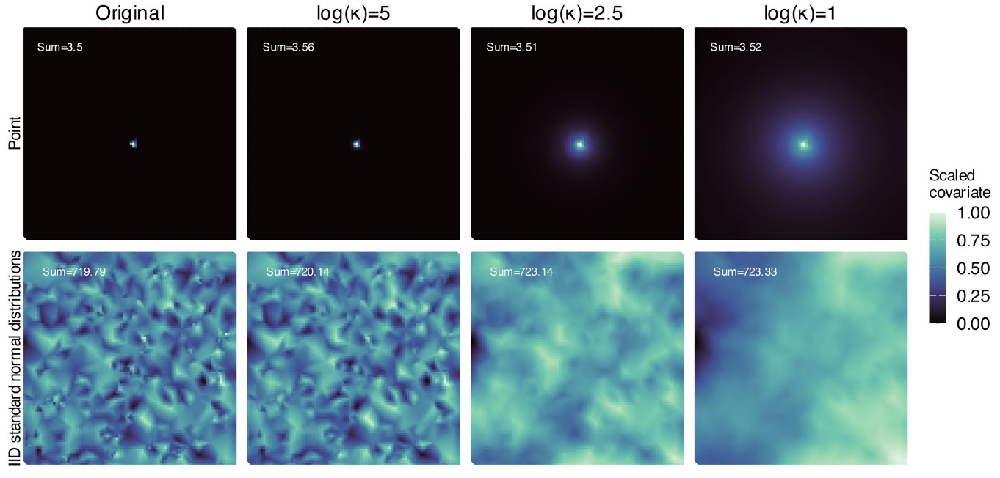
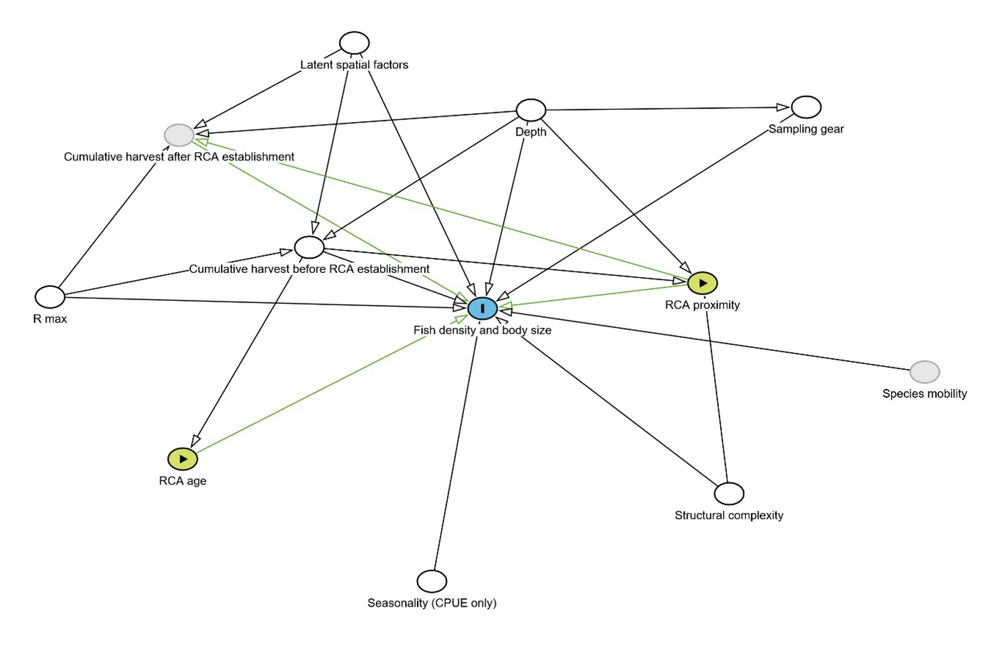

<!-- Build with: xaringan::inf_mr() -->

```{r preamble, include=FALSE, cache=FALSE}
source(here::here("slides/preamble.R"))
do.call(knitr::opts_chunk$set, knitr_opts)
```

```{r libs, include=FALSE}
library(dplyr)
library(sdmTMB)
library(ggplot2)
```

# Multivariate estimation

A major focus of VAST and tinyVAST

Thus far has we've kept this as an intentional difference between sdmTMB/VAST/tinyVAST

You *can* fit multivariate models in sdmTMB assuming you want the species, length bins, etc. to have independent fields

See the [multispecies sdmTMB vignette](https://sdmtmb.github.io/sdmTMB/articles/multispecies.html)

---

# Combining multiple data types

.small[
Lets you combine presence/absence, count, and continuous positive data in the same model.

Currently fully functional [on a branch](https://github.com/sdmTMB/sdmTMB/tree/multiple-data). To be merged into `main` branch shortly. A [vignette is available](https://github.com/sdmTMB/sdmTMB/blob/multiple-data/vignettes/articles/multi-family.Rmd).

Same interface as tinyVAST

```r
family_list <- list(
  binomial = binomial(link = "cloglog"),
  nbinom2 = nbinom2(),
  delta_lognormal = delta_lognormal(type = "poisson-link")
)
```
]

.tiny[
Grüss, A., and Thorson, J.T. 2019. Developing spatio-temporal models using multiple data types for evaluating population trends and habitat usage. ICES Journal of Marine Science 76(6): 1748–1761. <https://doi.org/10.1093/icesjms/fsz075>.
]

---

### "Distributed lag" models

.xsmall[
Estimated spatial, temporal, or spatiotemporal diffusive effects of covariates

Mostly finished in a branch of sdmTMB, to be merged in soon
]



.tiny[
Lindmark, M., Anderson, S.C., and Thorson, J.T. 2025. Estimating scale-dependent covariate responses using two-dimensional diffusion derived from the stochastic partial differential equation method. Methods in Ecology and Evolution. <https://doi.org/10.1111/2041-210X.70177>
]

---

# Much faster MCMC sampling with SNUTS

Sparse NUTS (No-U-Turn Sampler)

Decorrelates the posterior using the joint precision matrix from TMB

Up to ~30x faster for sdmTMB models

Preprint out soon?

Folded into adnuts

<https://github.com/Cole-Monnahan-NOAA/adnuts/>

---

# Structural causal modelling

.small[
DAGs with GLMMs or as Dynamic Structural Equation Models (DSEM)
]

.pull-left[

]

.pull-right[
.xtiny[
Arif, S., and MacNeil, M.A. (2022). Applying the structural causal model framework for observational causal inference in ecology. Ecological Monographs 93(1): e1554. <https://doi.org/10.1002/ecm.1554>.

Thorson, J. T., Andrews, A. G., Essington, T., & Large, S. (2024). Dynamic structural equation models synthesize ecosystem dynamics constrained by ecological mechanisms. Methods in Ecology and Evolution 15(4): 744-755. <https://doi.org/10.1111/2041-210X.14289>

Wilson, K.L., Frid, A., and Anderson, S.C. 2025. Groundfish with diverse life histories increase in size and abundance with proximity to spatial protections. bioRxiv. <https://doi.org/10.1101/2025.11.28.691246>.

]
]

---

# An improved understanding of data integration

We're only starting to understand issues that can arise with expanded domain data integration

Best practices for combining different data types and surveys with different length selectivities

Integration of geostatistical and movement data in shared models
